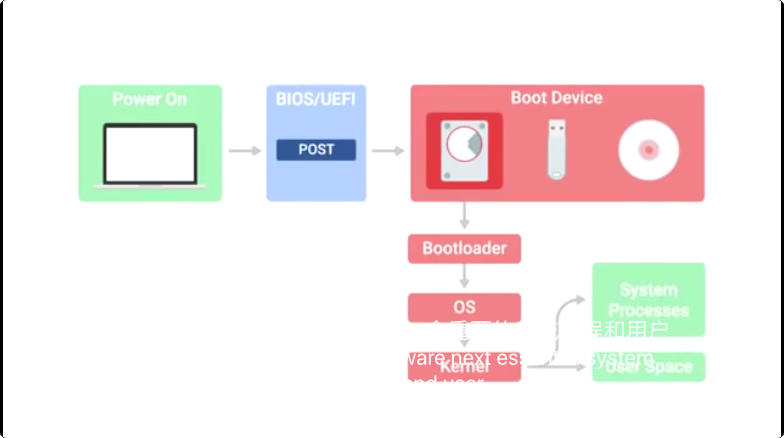
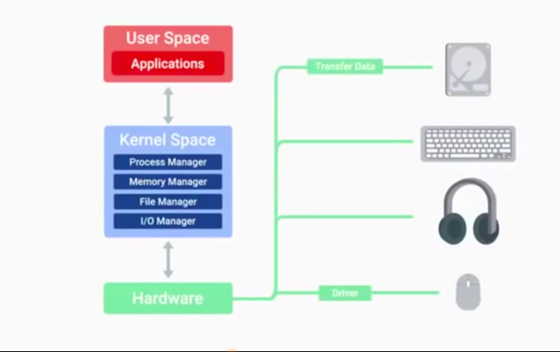

# What is IT? 什么是信息技术
## 信息技术的作用
信息技术转变了生活方式，感谢IT, 我们能够和世界各地的人们和组织交流大量的信息。并且计算机可以为任何事情提供动力，计算器、医疗器械、复杂的卫星系统等，它强大的动力促使人们能够做好手中的事情并且**彼此之间能够相互联系**。
## 信息技术具体的含义
信息技术是**有效的数字技术的使用**。比如电脑和因特网，用来储存并且处理数据使之成为有用的信息，
## 信息技术产业
信息技术产业包括整个学校中、社会中一切**与电脑技术有关的工作和资源**。

---

# Computer architecture overview 电脑结构概述
计算机可以分为四个主要的后次：**硬件、操作系统、软件和用户**
## Hardware Layer 硬件层 
由计算机的**物理部分**构成的。
## Operating System 操作系统
**允许硬件和系统联系。**
## Software Layer 软件层
人们如何和我们电脑**相互作用**的途径。
## User 用户层
计算机体系结构的**中心层**，与计算机互相作用，能够操作、维护、甚至给电脑编程。

---

# Programs and Hardware 程序与硬件
我们的计算机只能以**二进制用0或1**进行交流，计算机使用**机器语言**，而我们人类使用**自然语言**。
## Programs程序
程序基本上是**告诉计算机要做什么命令。**

---

# Hardware 硬件
## CPU 中央处理器
 计算机的**核心、大脑**，完成了所有的计算和数据处理。它可以处理人们提供给它的信息使得计算机运算的非常快，持续用**二进制**执行
## RAM 随机存取存储器
 计算机的**短期记忆部件**，它可以将信息存储在一个位置，相较于硬盘中的信息，CPU可以更快地接收它存储的信息。RAM可以存储**数以亿计**的数据。
 
 ---
## Hard Drive 硬盘
保留着我们所有的数据。
## Motherboard 主板
连接计算机所有部件的部位
## EDB (External Data Bus) 外部数据总线
使计算机**各个部分相连的线**。当我们向其中一个电线**发送电压**时，我们说它是打开状态的，用数字1表示；当没有电压时，我们说导线是关
的，如1比特、16比特、32比特甚至64比特。
## Registers 寄存器
在CPU内部，能够存储**CPU使用的数据**，能够将二进制语言翻译成为它可以完成的任务。
## MCC (Memory Controller Chip) 内存控制器芯片
 是在CPU和计算机其它部位之间的桥梁。
## Address Bus 地址总线
**联系CPu和MCc**, 并发送数据的地址位置。随后MCC接收这一位置并寻找数据，然后数据会被发送到EDB上面。
## Cashe 高速缓冲存储器
存储容量比RAM小，但可以存储经常使用或最近使用的数据，并且能够迅速地使用这些数据。
## Clock Speed 时钟速度
在一段特定的时间内CPU所能处理的最大的时钟周期数。
## Overclocking 
**提高CPU时钟周期的速率**使之能够完成更多的任务。

---

# Operating System 操作系统 
 操作系统是**管理人们计算机的资源并使得人们与之相互联系的程序包**，其有两个主要部分构成－**内核和用户空间**。
## 内核
 是操作系统的**主要核心**，其直接与硬件联系并且关系我们系统的资源。其主要包括：
### 文件管理
内核完成文件**存储和管理**的工作。
### 进程管理
内核的另外一个重要功能是进程管理，如进程调度器是使**多任务处理**成为可能的内核的一部分。



### *分析：操作系统为每个线程分配时间片。对于操作系统而言,一个任务就是一个进程, 进程是系统中程序执行和资源分配的基本单位。每个进程都有自己的数据段,代码段和堆栈段多任务就是操作系统可以同时运行多个任务电脑多任务与CPU核心线程，内存有关。比如四核八线程比四核四线程强，六核心比四核心的强*

### 内存管理 
优化内存使用，并确保应用程序有足够的内存运行。
### 输入输出管理
即管理任何给我们**输入**的东西或者我们可以用来**输出**数据的东西。
## 用户空间
基本上是由**内核外一切部件**构成的，是人们*直接与系统程序联系*的部分。

---

# Interaction with the OS 与操作系统的联系
有两种方法可以让我们和操作系统联系：**Shell或者图形用户**界面。
## Shell
基本上是一个解释文本命令并将它们发送到操作系统执行的程序。它在大多数情况下意味着我们将使用文本命令。
## GUI图形交互页面
是一种可见的与计算机交互的方式，我们可以看到我们用它做的任何事情。

---

# Basics of Networking 网络基础
## Internet互联网
 是世界上**计算机和电线**的物理连接。
## Web
是互联网上的信息，
## 万维网
是**访问互联网**的一种途径，但不是唯一途径，电子邮件、聊天软件等等也都是访问互联网的途径。
## Networking 
被认为是**管理、建造和设计**网络。
## 服务器 
直接连接到互联网的计算机，**存储我们使用的网站**。
## 客户端
如笔记本、手机等，不会直接连接到互联网，而是与网络提供商ISP运营的一个网络相连。
## 互联网
**所有网络共同组成**的一个巨大的计算机网络
## IP ADDRESS 
网络上的计算机有一个叫做IP地址的标识符，访问网站实际上是找到这些问站的IP地址，
## MAC ADDRESS 
设备的标识，通常显**永久的**并且被编码在设备上的
当你通过网络接收或发送数据时，你需要有IP和MAC地址。
## Packets 数据包
通过网络发送的数据是通过数据包发送的，**当我们通过网络移动数据时，我们将他们分解成数据包，当一个数据包到达目的地时，它便会重新整理自己使其恢复顺序。**

---
# How the Internet Works 互联网如何工作
## TCP/IP 1
今天互联网上使用的**协议**
## WWW万维网
利用**不同的协议在网页中显示信息，成为访问互联网的主要方式**。


```python

```
